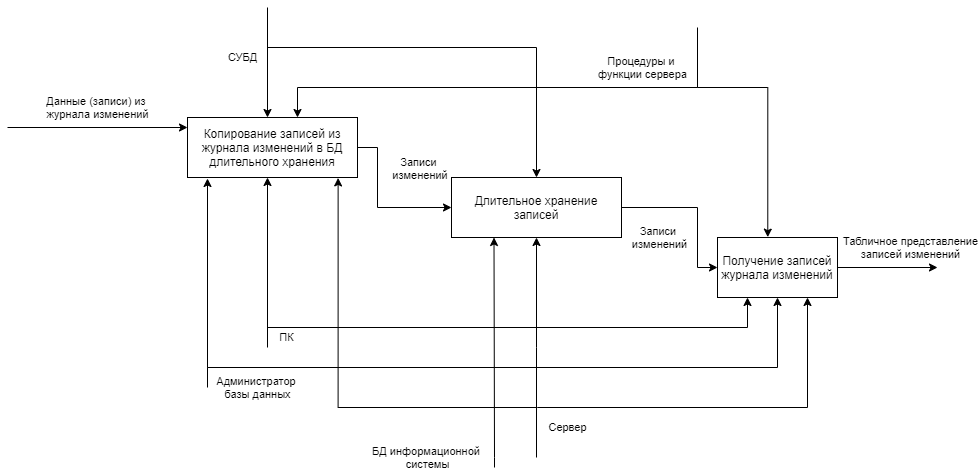

# Выпускная квалификационная работа по теме "Создание системы долговременного хранения журнала событий Лоцман PLM"
## 1. Теоретическая часть

На предприятии для хранения и управления конструкторско-технологическими данными о разрабатываемой продукции используется система «ЛОЦМАН:*PLM*». «ЛОЦМАН:*PLM*» — система управления инженерными данными и жизненным циклом изделия, предназначена для автоматизации конструкторско-технологической подготовки производства. Система представляет собой платформу с программными инструментами для управления жизненным циклом изделия. Кроме базовых инструментов, в состав входит набор прикладных модулей для решения задач в более специализированных областях, а также веб-клиент для удаленного доступа к данным через браузер.

Функции системы:

- Управление данными с учетом таких аспектов, как создание, разработка, управление, согласование, утверждение и хранение данных.
- Управление структурой и конфигурациями изделия позволяет создавать многовариантные структуры изделия, исключая при этом необходимость описания каждого варианта в полном объеме, вместо этого описывая только отличия.
- Управление требованиями позволяет создавать и описывать как отдельные требования к изделию, так и связанные структуры с группами и подгруппами.
- Планирование и управление проектами позволяет сформировать планы в виде структуры взаимосвязанных работ, связать задачи между собой, задать сроки выполнения, назначить исполнителей, приоритеты.
- Управление бизнес-процессами обеспечивает эффективное управление бизнес-процессами предприятия, позволяя каждому участнику получать исходные данные для работы, фиксировать свои результаты и передавать задания другим участникам процесса.
- Формирование различных отчетов в форматах офисных пакетов, а также с помощью генератора отчетов *FastReport*.
- Взаимодействие системы как с решениями АСКОН в рамках единого программного комплекса, так и с продуктами других разработчиков. Наиболее тесная интеграция реализована для систем «КОМПАС-3*D*», «ВЕРТИКАЛЬ», «ПОЛИНОМ:*MDM*» и других решений АСКОН.

Система «ЛОЦМАН:*PLM*» может работать с БД, управляемыми *MS SQL Server* или *Oracle*. На предприятии используется СУБД *MS SQL Server*. БД содержит набор объектов, в который входят:

- Пользователи – круг лиц, которые имеют доступ к базе данных системы «ЛОЦМАН:*PLM*».
- Группы – пользователи, которые объединены выполняемыми на предприятии функциями и имеют одинаковые права доступа к метаданным.
- Файловые архивы – сетевые или локальные ресурсы, на которых хранятся файлы, связанные с объектами базы данных.
- Журнал – протокол пользовательских действий.
- Синхронизация – настройки текущей базы данных как участника системы синхронизации данных «ЛОЦМАН:*PLM*».

Для управления «Комплексом решений Аскон» используется «Центр управления Комплексом» (ЦУК). Он группирует средства управления, которые используются для администрирования серверов, баз данных, справочников и прочих компонентов. С помощью ЦУК через оснастку «Базы данных» осуществляются следующие действия:

- настройка подключения каждой базы данных к серверу баз данных;
- определение параметров базы;
- управление базами данных «ЛОЦМАН:*PLM*»;
- управление синхронизации данных, содержащихся базах данных «ЛОЦМАН:*PLM*»;
- выбор и изменение глобального файла конфигурации «ЛОЦМАН:*PLM*»

В БД системы существует совокупность таблиц – «Журнал событий». Он предназначен для фиксации и просмотра списка действий, совершенных пользователями в системе «ЛОЦМАН:*PLM*». ЦУК позволяет просматривать список пользовательских действий в соответствии с наложенным пользовательским фильтром.

## 2. Проектная часть

### 2. 1. Техническое задание
#### 2. 1. 1. Постановка задачи

В рамках выпускной квалификационной работы предполагается разработка системы на тему «Создание системы долговременного хранения журнала событий «ЛОЦМАН:*PLM*». Требуется разработать информационную систему, позволяющую оптимизировать хранение и использование работниками предприятия журнала событий системы «ЛОЦМАН:*PLM*». Данная информационная система должна обеспечивать хранение журнала в более оптимальном виде и вывод записей с фильтрацией. Доступ к данным функциям будет предоставляться АБД, который будет предоставлять отчеты по информации в БД под контролем руководства предприятия. Доступ к данным функциям будет предоставляться только администратору БД.

Созданный продукт должен иметь следующие основные функции:

-   Вывод записей об изменениях по БД создаваемой системы и по БД системы «ЛОЦМАН:*PLM*». Фильтрация по полям: дата, комментарий, имя пользователя, имя объекта.

-   Перемещение записей журнала изменений из БД системы «ЛОЦМАН:*PLM*» в БД создаваемой системы.

-   Создание БД долговременного хранения журнала событий системы «ЛОЦМАН:PLM» с помощью скрипта.

Входные данные — записи журнала событий из БД системы «ЛОЦМАН:*PLM*». Записи показывают действия, совершенные пользователями в системе.

Выходные данные — табличное представление записей БД системы в программе с графическим интерфейсом. Эти данные требуются АБД для просмотра действий пользователей в системе «ЛОЦМАН:*PLM*».

#### 2. 1. 2. Технические требования к программному изделию

Требования к функциональным характеристикам. Программа должна выполнять следующие функции:

-   Вывод данных (записей) об изменениях из БД создаваемой системы и БД системы «ЛОЦМАН:*PLM*». Для этих данных должна быть возможность устанавливать фильтрацию по полям: дата изменения, ФИО пользователя, имя объекта (несколько значений), комментарий. При фильтрации по текстовому полю алгоритм должен искать не полное соответствие, а подстроку.

-   Перемещение записей журнала изменений из БД системы «ЛОЦМАН:*PLM*» в БД создаваемой системы. Программа должна позволять устанавливать количество записей, копируемых за одну транзакцию. Пользователь должен видеть прогресс выполнения перемещения записей.

-   Автоматизированное создание и настройка БД создаваемой системы. Программа должна запрашивать основные характеристики: имя сервера, имена БД, имена таблиц. После ввода пользователю выдается полный текст запросов, который он может редактировать. В результате, на основании этого текста создается база данных, хранимые функции и процедуры, пользовательские типы.

Всевозможные настройки программы должны сохраняться в реестр для пользователя.

Долговременное хранение записей журнала событий обеспечивает БД. СУБД ограничивает доступ к данным. Запись данных в БД осуществляется благодаря 2 функции. Изначально данные находятся в 2 таблицах. Таблица «Журнал» содержит поля: идентификатор изменения, дата и время изменения, имя пользователя, имя объекта, комментарий, идентификатор типа операции, идентификатор группы, идентификатор объекта. Таблица «Типы операций» содержит поля: идентификатор типа операций, имя типа, правило комментирования, имя процедуры. Записи в этих таблицах являются входными данными.

Выходными данными является графическое табличное представление, имеющее все поля записей таблицы «Журнал». Это представление является результатом функции 1.

При копировании данных не должно быть приведения типов, сжатия данных, которое приводит к потерям этих данных.

Требования к надёжности:

-   контроль вводимой информации;

-   блокировка некорректных действий пользователя при работе с системой;

-   целостность хранимой информации;

-   ограничение несанкционированного доступа к данным.

Со стороною заказчика надежное функционирование программы должно быть обеспечено выполнением совокупности организационно-технических мероприятий:

Условия эксплуатации:

-   Организация бесперебойного питания технических средств.

-   Выполнение рекомендаций Министерства труда и социального развития РФ, изложенных в Постановлении от 23 июля 1998 г. «Об утверждении межотраслевых типовых норм времени на работы по сервисному обслуживанию ПЭВМ и оргтехники и сопровождению программных средств».

-   Выполнение требований ГОСТ 51188-98 «Защита информации. Испытания программных средств на наличие компьютерных вирусов».

-   Необходимый уровень квалификации сотрудников профильных подразделений.

-   Минимальное количество персонала, требуемого для работы программы, должно составлять не менее 2 штатных единиц — системный программист и конечный пользователь программы — АБД.

Требования к составу и параметрам технических средств. В состав технических средств должен входить IBM-совместимый персональный компьютер (ПЭВМ), минимальные технические характеристики которого:

-   процессор с 86- или 64-разрядной архитектурой с частотой в 1 ГГц;

-   оперативная память объемом 1 Гбайт;

-   свободное место на диске объемом 10 Мбайт.

Требования к информационной и программной совместимости. Исходные коды программы должны быть написаны на языке *С#*. В качестве интегрированной среды разработки программы должна быть использована среда *Microsoft Visual Studio* 2019. Взаимодействие с СУБД и создание базы данных реализуется на языке *T-SQL*. Системные программные средства, используемые программой, должны быть представлены лицензионной версией операционной системы не ниже *Windows* 7.

Требования к маркировке и упаковке. Программа поставляется в виде программного изделия на внешнем носителе — флеш-накопителе, на котором должны содержаться программная документация, приложение.

Требования к транспортированию и хранению. Допускается транспортировка программного изделия всеми видами транспортировки.

#### 2. 1. 3. Требования к информационной безопасности

В системе должен быть обеспечен надлежащий уровень защиты информации в соответствии с законом «Об информации, информатизации и защите информации» РФ № 24-ФЗ от 20.02.95. В соответствии с этим законом защита информации представляет собой принятие правовых, организационных и технических мер, направленных на:

1. обеспечение защиты информации от неправомерного доступа, уничтожения, модифицирования, блокирования, копирования, предоставления, распространения, а также от иных неправомерных действий в отношении такой информации;
2. соблюдение конфиденциальности информации ограниченного доступа;
3. реализацию права на доступ к информации.

#### 2. 1. 4. Функциональная модель решения задачи

Функциональная модель — это совокупность регламентов бизнес-процессов, подлежащих автоматизации в рамках разрабатываемой системы. Функциональную модель составляют в соответствии с описанием целей функционирования. В результате построения функциональной модели заказчик и исполнитель четко представляют последовательность действий при использовании информационной системы должностными лицами.

Для функционального моделирования обычно используют *IDEF0* методологию. *IDEF0* — это методология функционального моделирования и графическая нотация, предназначенная для формализации и описания бизнес-процессов. Отличительной особенностью *IDEF0* является её акцент на соподчинённость объектов. В *IDEF0* рассматриваются логические отношения между работами, а не их временная последовательность.

Стандарт *IDEF0* представляет организацию как набор модулей, здесь существует правило — наиболее важная функция находится в верхнем левом углу, кроме того, существуют правила сторон: Описание выглядит как «чёрный ящик» с входами, выходами, управлением и механизмом, который постепенно детализируется до необходимого уровня.

На рисунках 1 и 2 изображены контекстная и детальная диаграмма соответственно в нотации *IDEF0*. Они показывают основной процесс, который система автоматизирует на производстве.

Рисунок 1 – Контекстная диаграмма ИС

Рисунок 2 – Детальная диаграмма ИС

Вход  объекты, используемые и преобразуемые работой для получения результата. На созданных диаграммах на вход подается данные журнала событий из БД системы «ЛОЦМАН:*PLM*» для записи в БД долговременного хранения.

Выход — объекты, в которые преобразуются входные данные. На выходе получается табличное представление записей журнала событий

Управление — информация, управляющая действиями работы. Управляющими объектами являются СУБД процедуры и функции, созданные АБД на сервере.

Механизм — ресурсы, выполняющие работу. Механизмами являются: АБД, аппаратная часть сервера, БД, ПК администратора.

#### 2. 1. 5. Информационное обеспечение задачи

Как показано на рисунке, входными данными системы являются записи из таблиц «Журнал» и «Типы операций» БД системы «ЛОЦМАН:*PLM*». Таблица «Журнал» содержит следующие данные:

- идентификатор изменения — целочисленный тип;

-   дата и время изменения — тип даты и времени;

-   имя пользователя (автора изменения) — текст;

-   имя объекта, свойства которого были изменены в системе «ЛОЦМАН:*PLM*» — текст;

-   комментарий — текст;

-   идентификатор типа операции — целое число;

-   идентификатор группы — целое число;

-   идентификатор объекта в системе «ЛОЦМАН:*PLM*» — целое число.

Таблица «Типы операций» содержит данные:

-   идентификатор типа операций — целое число;

-   имя типа (описание) — текст;

-   правило комментирования — текст;

-   имя процедуры — текст.

Выходными данными является графическое табличное представление, имеющее поля:

-   идентификатор изменения — целочисленный тип;
-   дата и время изменения — тип даты и времени;
-   имя пользователя (автора изменения) — текст;
-   имя объекта, свойства которого были изменены в системе «ЛОЦМАН:*PLM*» — текст;
-   комментарий — текст;
-   идентификатор типа операции — целое число;
-   идентификатор группы — целое число;
-   идентификатор объекта в системе «ЛОЦМАН:*PLM*» — целое число.

#### 2. 1. 6. Структура файлов базы данных

Структура БД показана на рисунке 3, а в таблицах 1–5 каждая таблица описана более подробно.

Рисунок 3 — Структура БД разрабатываемой информационной системы

Таблица 1 — Структура таблицы «*Journal*»

| Идентификатор поля | Тип поля | Разрешены значения *NULL* | Описание поля                                  |
| ------------------ | -------- | ------------------------- | ---------------------------------------------- |
| inId               | bigint   | Нет                       | Идентификатор события в журнале                |
| dtDate             | datetime | Нет                       | Дата и время события                           |
| inUser             | int      | Да                        | Идентификатор имени пользователя, внешний ключ |
| inObject           | bigint   | Да                        | Идентификатор имени объекта, внешний ключ      |
| inComment          | bigint   | Да                        | Идентификатор имени пользователя, внешний ключ |
| inOperation        | int      | Нет                       | Идентификатор типа операции, внешний ключ      |
| inGroup            | tinyint  | Да                        | Идентификатор группы                           |
| idobject           | int      | Да                        | Идентификатор объекта в системе «ЛОЦМАН:PLM»   |

Таблица 2 — Структура таблицы «*Objects*»

| Идентификатор поля | Тип поля     | Разрешены значения *NULL* | Описание поля               |
| ------------------ | ------------ | ------------------------- | --------------------------- |
| inId               | bigint       | Нет                       | Идентификатор имени объекта |
| stName             | varchar(750) | Нет                       | Имя объекта                 |

Таблица 3 — Структура таблицы «*Users*»

| Идентификатор поля | Тип поля     | Разрешены значения *NULL* | Описание поля                    |
| ------------------ | ------------ | ------------------------- | -------------------------------- |
| inId               | bigint       | Нет                       | Идентификатор имени пользователя |
| stName             | varchar(255) | Нет                       | Имя пользователя                 |

Таблица 4 — Структура таблицы «*Comments*»

| Идентификатор поля | Тип поля     | Разрешены значения *NULL* | Описание поля             |
| ------------------ | ------------ | ------------------------- | ------------------------- |
| inId               | bigint       | Нет                       | Идентификатор комментария |
| stName             | varchar(750) | Нет                       | Текст комментария         |

Таблица 5 — Структура таблицы «*Operations*»

| Идентификатор поля | Тип поля      | Разрешены значения *NULL* | Описание поля                   |
| ------------------ | ------------- | ------------------------- | ------------------------------- |
| inId               | bigint        | Нет                       | Идентификатор события в журнале |
| stName             | varchar(750)  | Да                        | Называние типа операции         |
| stCommentRule      | varchar(1000) | Да                        | Правило комментирования         |
| stProcedureName    | varchar(255)  | Да                        | Имя процедуры                   |

### 2.2. Рабочий проект

#### 2. 2. 1. Алгоритм решения задачи

Исходя из вышеизложенных функциональных требований можно сказать, что программа должна быть многофункциональной, на разные входные данные и запросы пользователя реагировать определенным образом. Такое поведение хорошо описывается блок-схемой.

Блок-схема — распространённый тип схем (графических моделей), описывающих алгоритмы или процессы, в которых отдельные шаги изображаются в виде блоков различной формы, соединённых между собой линиями, указывающими направление последовательности.

В на рисунке 4 представлена блок-схема, описывающая алгоритм решения задачи.

Рисунок 4 — Блок-схема алгоритма

Блок-схема начинается с блока «Начало». Блоки 1 и 2 представляют главное меню программы. После выбора элемента блок 3 осуществляет ветвление по пунктам:

1)  Вывод и фильтрация. Пункт содержит собственное меню (блоки 4 и 5), позволяющее: осуществить вывод журнала событий (блок 7), настроить фильтры вывода (блоки 9-13), закрыть пункт. Вывод журнала событий является блоком-функцией «*Output_1*» и после выполнение циклически переходит к 4 блоку. Блок 8 позволяет после изменения значений фильтров сохранить их (выполнить блок-функцию 13) если они пройдут валидацию в блоке 12, и перейти обратно к блоку 4. Иначе алгоритм циклически переходит к изменению фильтров.
2)  Группа копирования (14—17) имеет меню (блоки 14-15). При выборе пункта «Копировать» выполняется блок-функция «*Copy_1*», которая осуществляет функцию копирования данных из БД системы «ЛОЦМАН:*PLM*» в БД создаваемой ИС. Затем цикл переходит обратно к меню. При закрытии алгоритм выполняет функцию «Close_2» и переходит в главное меню (блок 1).
3)  Группа блоков «Изменение настроек» (блоки 18—22) служит для изменения и сохранения информации о серверах, БД и таблицах для подключения к ним. После сохранения с помощью пункта меню (блоки 18 и 19). Если в блоке 19 изменения пройдут валидацию, то выполняется блок-функция 20, сохраняющая эти изменения настроек и алгоритм переходит в главное меню. Иначе цикл возвращается к изменению настроек (блок 16).
4)  Последний пункт — закрытие программы (выход). Благодаря функции «*Exit_1*» (блок 21) он позволяет корректно завершить работу программы. На этом алгоритм завершает свою работу.

#### 2. 2. 2. Описание программы

Информационная система, разработанная по теме «Создание системы долговременного хранения журнала событий Лоцман *PLM*», позволяет выполнять следующие действия:

-   Вывод записей об изменениях по БД создаваемой системы и по БД системы «ЛОЦМАН:*PLM*». Фильтрация по полям: дата, комментарий, имя пользователя, имя объекта.

-   Перемещение записей журнала изменений из БД системы «ЛОЦМАН:*PLM*» в БД создаваемой системы.

-   Создание БД долговременного хранения журнала событий системы «ЛОЦМАН:*PLM*» с помощью скрипта.

Исходные коды системы написан на языке *С*\# при помощи среды разработки *Microsoft* *Visual* *Studio* 2019. Для работы БД использована СУБД *MS* *SQL* *Server*. Запросы, хранимые процедуры написаны на языке *T-SQL*.

Минимальные технические характеристики для работы ИС:

-   процессор с 86- или 64-разрядной архитектурой с частотой в 1 ГГц;

-   оперативная память объемом 1 Гбайт;

-   свободное место на диске объемом 10 Мбайт.

Входными данными являются записи журнала событий из БД системы «ЛОЦМАН:*PLM*». Выходными данными является табличное представление записей БД системы в программе с графическим интерфейсом.

Исполняемый файл занимает около 70 Кбайт. Вызов программы выполняется путем запуска исполняемого файла.

Для работы с программой требуется монитор, мышь и клавиатура. Во время работы ИС может активно использовать оперативную память, процессор, дисковое пространство.

Алгоритм работы программы представлен блок-схемой на рисунке 4.

#### 2. 2. 3. Руководство оператора (пользователя)

Созданное ПО (далее — «Архиватор») используется для создания и использования базы данных, которая позволяет более оптимально хранить и применять данные журнала событий.

«Архиватор» представляет собой приложение с графическим интерфейсом, которое обменивается данными с сервером. Функции созданного ПО:

-   просмотр и фильтрация событий;

-   архивация журнала событий (перемещение или копирование данных из одной БД в другую);

-   создание архива (базы данных), таблиц, хранимых процедур и функций для обеспечения правильной работы программы.

Главное окно программы (рисунок 5) содержит панель с навигацией по 3-м страницам: «Поиск», «Архивация» и «Настройка».

Рисунок 5 — Главное окно программы, страница «Поиск»

Страница «Поиск» на рисунке 5 содержит панель кнопок, элемент для вывода данных в виде таблицы и панель-индикатор.

Кнопки:

-   «Вывести»: приложение передает параметры фильтрации (дата, имя пользователя, имя объекта) в функцию, хранимую на сервере, получает результат и выводит его в виде таблицы.

-   «Фильтры»: открывает окно (рисунок 6), в котором пользователь может выбрать параметры фильтрации для вывода.

-   «Отменить»: программа пытается отменить операцию вывода.

-   «Очистить»: удаляет все данные из элемента вывода результатов.

Рисунок 6 — Окно «Фильтры»

Элемент вывода результатов выводит данные, полученные с сервера в виде таблицы.

Панель-индикатор содержит:

-   Индикатор, показывающий анимацией, выполняется ли поиск.

-   Текст, показывающий, сколько времени выполняется текущая операция поиска.

-   Количество строк, выведенных в текущий момент.

Окно «Фильтры» позволяет:

-   указать временной интервал;

-   указать, нужно ли использовать временной интервал;

-   указать количество получаемых строк;

-   указать имя пользователя;

-   указать имена объектов (несколько);

-   указать комментарий;

-   сохранить настройки фильтров;

-   отменить изменения фильтров.

Страница «Архивация» (рисунок 7) содержит:

-   Список последних событий содержит последние 50 событий во время архивации.

-   Поле, позволяющее указать количество строк, перемещаемых за одну транзакцию.

-   Кнопка «Архивировать» начинает архивацию, программа обращается к хранимым процедурам на сервере.

-   Кнопка «Остановить» позволяет остановить архивацию.

-   Панель-индикатор показывает, выполняется ли поиск и выводит, сколько времени выполняется текущая операция архивации.

Рисунок 7 — Страница «Архивация»

Страница «Настройка» позволяет изменить настройки соединения. Кнопка «Создать базу данных архива» открывает окно создания БД-архива.

Рисунок 8 — Страница «Настройка»

Окно «Создание подключения» (рисунок 9) позволяет создать базу данных БД-архив, нужные таблицы, хранимые функции и процедуры скриптом, который хранится как ресурс в программе и форматируется под введенные настройки подключения. Слева окна находится поле, в которое выводится скрипт создания и где его можно отредактировать. Справа находятся текстовые поля с настройками для создания скрипта.

Рисунок 9— Окно «Создание подключения»

## Результаты проведенной работы

Рисунок 10 — Сравнение использования дискового пространства

Рисунок 11 — Сравнение времени фильтрации

